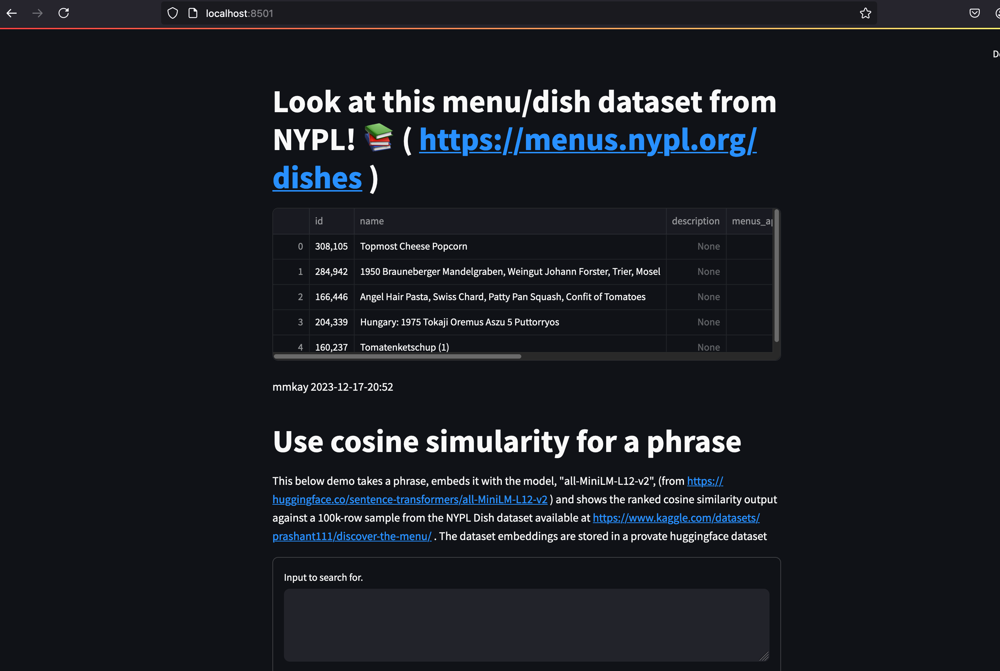

# how to run basic demo 
## prerequisites 
### tokens 
Refresh hugging face tokens for embeddings, into `.env` , `HF_TOKEN`
### requirements 
a new `python3 -m venv ~/.python_venvs/blahvenv` with , 
```
pip install -r requirements.txt
```


### setup local postgresql
One way to setup postgresql at least on macos, is to `brew install postgresql@14` . 
And then `brew install pgvector` (as noted per [pgvector docs](https://github.com/pgvector/pgvector?tab=readme-ov-file#homebrew)).  And note that as noted in those docs, at the time of this writing, this only installs the `pgvector` extension to `postgresql@14` of homebrew in particular. ( And this is try for `brew install postgis` incidentally. )


And add into a `.env` , the variables,

```sh
PG_USER=...
PG_PASSWORD=...
PG_HOST=localhost
PG_PORT=5432
```


## prepare data locally 
streamlit run app.py




### Add this kaggle uber eats data into postgresql , 

This csv data, `restaurant-menus.csv`, `restaurants.csv`, was downloaded from this [kaggle link](https://www.kaggle.com/code/sadeghjalalian/uber-eats-restaurant-menus/input?select=restaurants.csv).

And loaded to a local postgresql with the following.
```python

import polars as pl
menusdf = pl.read_csv("restaurant-menus.csv")
restaurantsdf = pl.read_csv("restaurants.csv")

menusdf = menusdf.with_columns(
    #price_cleaned=menusdf.select(pl.col("price").map_elements(lambda x:x.split(" ")[0])),
    price=pl.col("price").map_elements(lambda x:x.split(" ")[0]).cast(pl.Float32),
)

df = menusdf.join(
    restaurantsdf.rename({"name": "restaurant_name"}), 
    left_on="restaurant_id", 
    right_on="id")

# apply an id column.
df = df.with_columns(
    id=df.with_row_index()["index"],
)

from utils import embed_and_load_into_db, make_vectorstore_thing

vectorstore = make_vectorstore_thing()

# clean slate
vectorstore.drop_tables()

sample_df = df.sample(n=10000, seed=214)  # seed chosen to maximize the "chicken parmesan query results"

ids = utils.embed_and_load_into_db(
    sample_df.to_dicts(),
    id_col="id",
    text_col="name",
    metadata_cols=["price", "restaurant_name", "full_address", "lat", "lng"],
)
```

Quick search 

```python
from utils import search_pg_vector

vectorstore = make_vectorstore_thing()

docs_with_scores = search_pg_vector("chicken parm")
```
